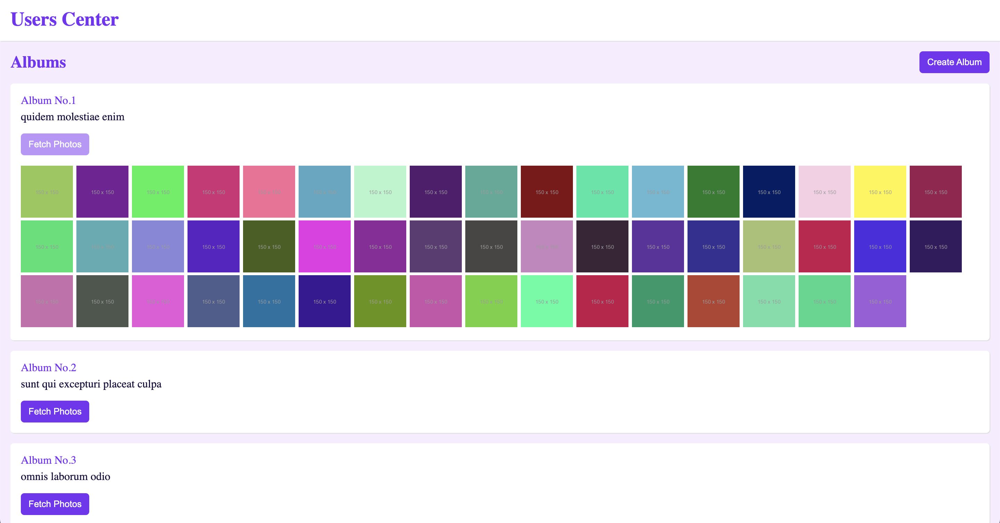

# Users: Albums and Photos

An application that lists all users and their addresses provided by the users API of JSONPlaceholder. Provide the possibility to view the albums and photos of a selected user. Allow the the possibility to create new albums. Unit and e2e tests are written for each components.

<p align="center">
  
   
</p>

## Content
- [ ] Framework: Angular with CLI
- [ ] State Management: NgRx Store, NgRx Effects, NgRx Selectors
- [ ] `{JSON}` Placeholder fake APIs: `/users`, `/albums`, `/photos`
- [ ] Unit tests with Karma & Jasmine
- [ ] e2e tests with Cypress


## Required
```
node: v18.10.0
yarn: 1.22.19
```

## Run Commands
```
"start": "ng serve",
"build": "ng build",
"watch": "ng build --watch --configuration development",
"test": "ng test",
"e2e": "ng e2e"
```
